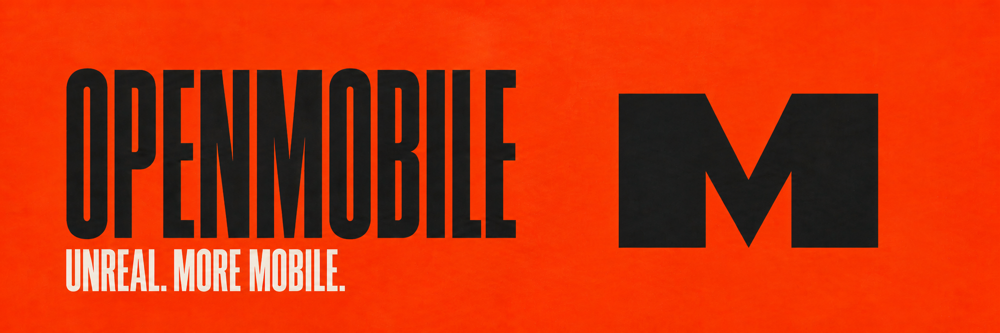

# OpenMobile

**Android and iOS plugins for Unreal Engine**

OpenMobile is a collection of mobile plugins I've built up (and use them myself!) over years of working with Unreal Engine. I'm open sourcing this because I want Unreal Engine to be better on mobile. I've spent a lot of time working through these problems, and I'd like that work to be useful to other developers too.

## What's included

| Feature | What you can do |
| --- | --- |
| [Ads](Services/OpenMobileAds) | Show ads through AdMob, handle consent, and add mediation networks. |
| [Haptics](Native/OpenMobileHaptics) | Create vibration patterns and play feedback from gameplay, UMG, Gameplay Abilities, or Sequencer. |
| [Sensors](Native/OpenMobileSensors) | Read motion, orientation, and other device sensors, with recording and replay for supported streams. |
| [Device info](Native/OpenMobileDevice) | Check battery and storage, monitor thermal and network status, and read display information. |
| [Permissions](Foundation/OpenMobilePermissions) | Shared C++ permission handling used by the sensor plugins. |
| [Photo picker](Native/OpenMobileMedia) | Let players pick a photo through the native system picker and get an Unreal texture back. |

[AdMob mediation adapters](Adapters/Ads) are included for AppLovin, Chartboost, Liftoff Monetize, Meta, and Unity Ads.

The gameplay plugins expose Blueprint and C++ APIs, with Core and Permissions providing shared C++ services. Enable the plugins your project needs and add others when you need them.

## Getting started

> [!NOTE]
> I'm still working on the documentation/tutorials for each one of the plugin and will take a bit of time.

### What to download

Open [v0.1.0](/ishtms/OpenMobile/releases/tag/v0.1.0) for the separate plugin downloads. These are **source plugins for Unreal Engine 5.8** and need to be compiled for your project.

Start with [OpenMobileCore](/ishtms/OpenMobile/releases/download/v0.1.0/OpenMobileCore-v0.1.0-UE5.8-Source.zip), which is required by every feature. Then pick what you want to use.

| You want | Download alongside Core |
| --- | --- |
| Device information | [Device](/ishtms/OpenMobile/releases/download/v0.1.0/OpenMobileDevice-v0.1.0-UE5.8-Source.zip) |
| Haptics | [Haptics](/ishtms/OpenMobile/releases/download/v0.1.0/OpenMobileHaptics-v0.1.0-UE5.8-Source.zip) |
| Sensors | [Sensors](/ishtms/OpenMobile/releases/download/v0.1.0/OpenMobileSensors-v0.1.0-UE5.8-Source.zip) and [Permissions](/ishtms/OpenMobile/releases/download/v0.1.0/OpenMobilePermissions-v0.1.0-UE5.8-Source.zip) |
| Photo picking | [Media](/ishtms/OpenMobile/releases/download/v0.1.0/OpenMobileMedia-v0.1.0-UE5.8-Source.zip) |
| Shared permission services in C++ | [Permissions](/ishtms/OpenMobile/releases/download/v0.1.0/OpenMobilePermissions-v0.1.0-UE5.8-Source.zip) |
| AdMob ads | [Ads](/ishtms/OpenMobile/releases/download/v0.1.0/OpenMobileAds-v0.1.0-UE5.8-Source.zip) and [AdMob](/ishtms/OpenMobile/releases/download/v0.1.0/OpenMobileAdsAdMob-v0.1.0-UE5.8-Source.zip) |

For haptics integrations, add [UMG](/ishtms/OpenMobile/releases/download/v0.1.0/OpenMobileHapticsUMG-v0.1.0-UE5.8-Source.zip), [Gameplay Abilities](/ishtms/OpenMobile/releases/download/v0.1.0/OpenMobileHapticsGameplayAbilities-v0.1.0-UE5.8-Source.zip), or [Sequencer](/ishtms/OpenMobile/releases/download/v0.1.0/OpenMobileHapticsSequencer-v0.1.0-UE5.8-Source.zip). Each also needs Haptics and Core. The Gameplay Abilities integration uses Unreal's built-in **Gameplay Abilities** plugin too.

For AdMob mediation, add only the networks you use - [AppLovin](/ishtms/OpenMobile/releases/download/v0.1.0/OpenMobileAdsAdMobAppLovin-v0.1.0-UE5.8-Source.zip), [Chartboost](/ishtms/OpenMobile/releases/download/v0.1.0/OpenMobileAdsAdMobChartboost-v0.1.0-UE5.8-Source.zip), [Liftoff Monetize](/ishtms/OpenMobile/releases/download/v0.1.0/OpenMobileAdsAdMobLiftoffMonetize-v0.1.0-UE5.8-Source.zip), [Meta](/ishtms/OpenMobile/releases/download/v0.1.0/OpenMobileAdsAdMobMeta-v0.1.0-UE5.8-Source.zip), or [Unity Ads](/ishtms/OpenMobile/releases/download/v0.1.0/OpenMobileAdsAdMobUnity-v0.1.0-UE5.8-Source.zip). Every adapter needs Core, Ads, and AdMob installed alongside it.

### What you need

- Unreal Engine 5.8 and a C++ compiler supported by that engine version.
- A C++ project so Unreal can compile the plugins. For a Blueprint-only project, add an empty C++ class first. You can keep writing your gameplay in Blueprints.
- For Android, Unreal's Android SDK, NDK, and JDK setup, plus internet access for build dependencies.
- For iOS, a Mac with Xcode supported by Unreal 5.8 and signing configured for your app.

### Install

1. Close the editor and create a `Plugins` folder beside your project's `.uproject` file if it does not already exist.
2. Extract every ZIP you downloaded into that `Plugins` folder. Merge their shared `OpenMobile` folder and keep the supplied folder layout.
3. Open the project, enable the plugins you want in the Plugin Browser, then close the editor before restarting.
4. Regenerate your project files, build your project's Editor target with Unreal Engine 5.8, then reopen the project.
5. Configure them under **Project Settings > OpenMobile**, then package your game for a real Android or iOS device.

For example, installing Core and Haptics should give you this layout.

```text
MyGame/
  MyGame.uproject
  Plugins/
    OpenMobile/
      Foundation/
        OpenMobileCore/
          OpenMobileCore.uplugin
      Native/
        OpenMobileHaptics/
          OpenMobileHaptics.uplugin
```

For AdMob, set your app IDs under **OpenMobile - AdMob**, configure placements under **OpenMobile Ads**, and start with test ads. Set up any mediation networks in your AdMob account too. The Android ads packages require compile SDK 35 or newer, Gradle 8.7, Android Gradle Plugin 8.6.1 through 8.6.x, and Java 17 through 21. The iOS ads packages require iOS 15 or newer.

## Help make it better

If you use OpenMobile in a project, I'd love to hear how it goes. Fixes, examples, and testing on different phones are all welcome.

If something breaks, [open an issue](/ishtms/OpenMobile/issues) with your Unreal version, device, and what happened. If you've worked out a fix, [send a pull request](/ishtms/OpenMobile/pulls).

See the [contributing guidelines](CONTRIBUTING.md) for bug reports, code changes, and device testing.

## License

OpenMobile code is available under the [MIT license](LICENSE). Bundled third-party SDKs keep their own licenses.
